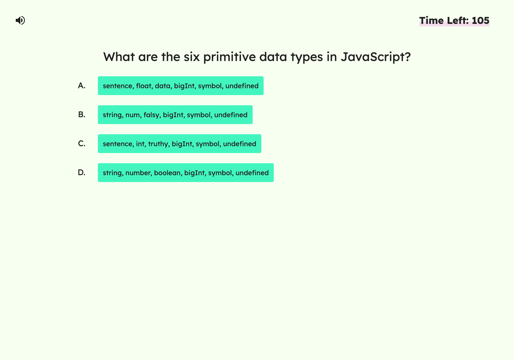
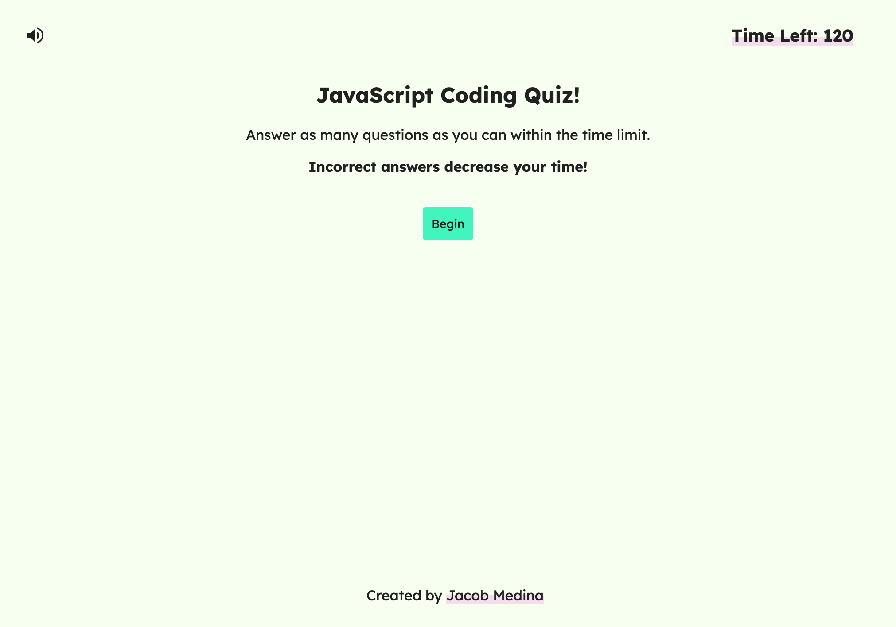
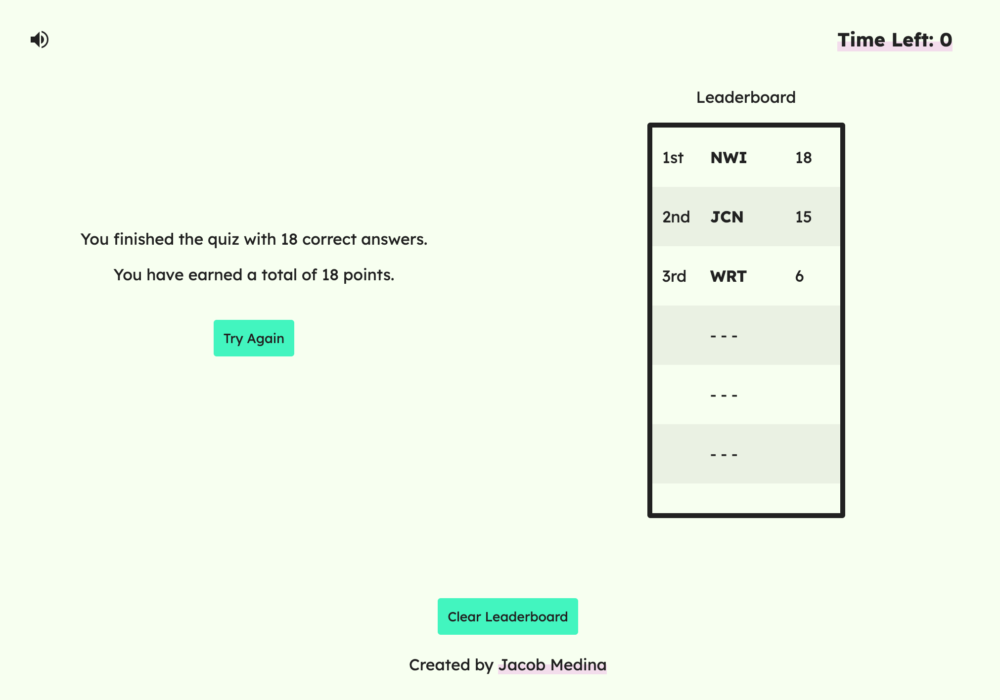

# JavaScript Coding Quiz

## Description

[Click here to visit the live webiste](https://jacob-medina.github.io/javascript-coding-quiz/)

This project is a timed, multiple-choice quiz with JavaScript coding questions. It also includes a leaderboard that saves locally for the user.

The aim of this project is to provide a space for web developers to practice their JavaScript skills for interviews or personal use. The quiz also includes a client-side leaderboard to spark competition and self-improvement. Leaderboard rankings are determined by the number of correct questions answered and amount of extra time left.

## Usage

Users may do the following:
- Resize the window to get a layout that is appropriate for the screen dimensions
- Click the **Begin** or **Try Again** button to begin the timed quiz

- Click answer **A**, **B**, **C**, or **D** to get feedback on if their answer was correct or not
- Enter their initials into a text box and click the **Submit** button to enter their quiz results into the leaderboard

- Click the **Clear Leaderboard** button to remove all saved leaderboard data
- Click the **Sound** icon at the top left to toggle sounds on and off
- Click **Jacob Medina** in the footer to be brought to my GitHub profile page

## Code Source

The three files that were edited in this project were `index.html`, `style.css`, and `script.js`.

These files can be found through the following path (from root):
- `index.html`
- `assets/css/style.css`
- `assets/js/script.js`

## Credits

The sound effects used in this project are not mine. The listed sound effects were created by the following creators:
- `whistle.mp3`
  - > strongbot, 2021, https://freesound.org/people/strongbot/sounds/568995/
- `tick.mp3`
  - > kubawolanin, 2013, https://freesound.org/people/kubawolanin/sounds/185609/
- `correct.mp3`, `incorrect.mp3`
  - > LaurenPonder, 2022, https://freesound.org/people/LaurenPonder/sounds/639432/

## License

This project is made under the [MIT License](./LICENSE)